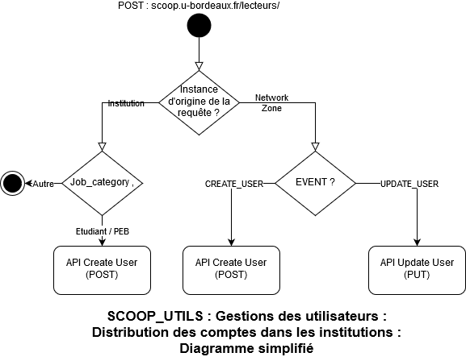

# Django SCOOP_UTILS : Gestion des lecteurs
Module Django avec tout une série de programme permettant de faciliter la gestion des lecteurs dans une configuration réseau :
## Distribution des lecteurs dans toutes les institutions 

### Distribution des lecteurs institutionnels
#### Description fonctionnelle
A chaque fois qu'un lecteur institutionnel (étudiant ou enseignant) est créé par le chargeur lecteur dans la Zone réseau , Alma appelle l'url dédiée en transmettant les informations du lecteur. Le compte est alors copié/lié dans toutes les institutions du réseau.
#### Brève description technique
Si l'appelle vient de la Zone réseau (institution == 33PUDB_NETWORK) et que le compte est créé (event == USER_CREATED), le programme copie/lie le compte dans les institutions en convoquant l'API [Get user details](https://developers.exlibrisgroup.com/alma/apis/docs/users/R0VUIC9hbG1hd3MvdjEvdXNlcnMve3VzZXJfaWR9/). La recherche du lecteur dans l'institution suffit à copier le lecteur.
### Distribution des comptes de lecteurs extérieurs ou des comptes des bibliothèques pour le PEB
#### Description fonctionnelle
A chaque fois qu'un compte pour un lecteur extérieur ou une bibliothèque PEB est créé/modifié dans une institution, il est copié dans toutes les autres institutions du réseau.
#### Description technique
Si lappelle ne vient pas de la zobne réseau et qu'il s'agit d'une création ou modification de compte (event == USER_CREATED ou event == USER_UPDATE), le programme copie/lie le compte dans les institutions en convoquant l'API [Create user](https://developers.exlibrisgroup.com/alma/apis/docs/users/UE9TVCAvYWxtYXdzL3YxL3VzZXJz/) ou [Update user](https://developers.exlibrisgroup.com/alma/apis/docs/users/UFVUIC9hbG1hd3MvdjEvdXNlcnMve3VzZXJfaWR9/)..
